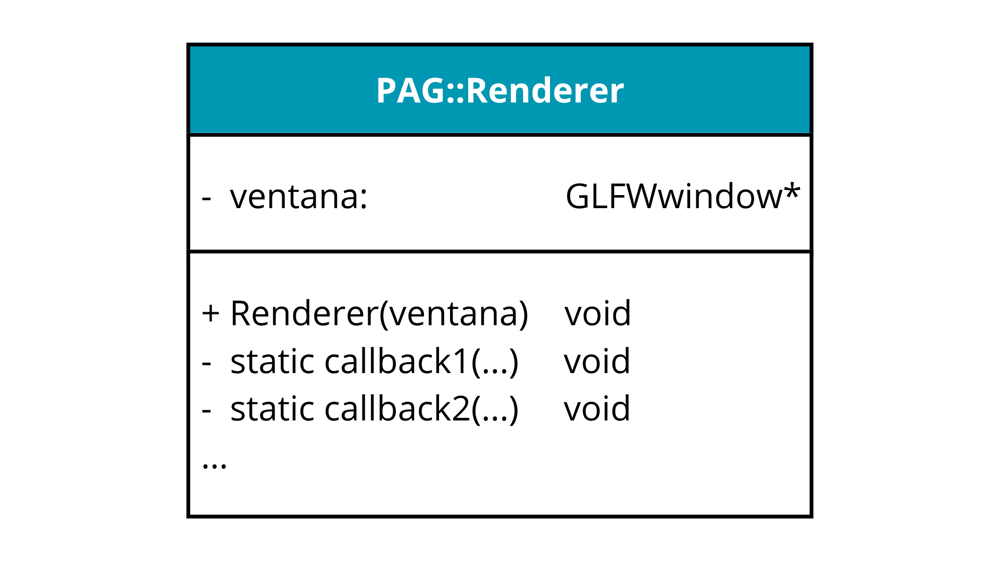

# PROGRAMACIÓN DE APLICACIONES GRÁFICAS
**Santiago Hervás del moral** `shm00025@red.ujaen.es`

---
## Práctica 1 - Configuración

---
### &rarr; Ejercicio de reflexión
El problema planteado se basa en diseñar una clase de C++ que encapsule los métodos relacionados al renderizado de la escena, con la dificultad de que los métodos de instancia de clase de C++ no se pueden usar como callbacks.

Los métodos asociados a las clases no se pueden usar como callbacks dado que dependen de una instancia de la clase. En C existen los métodos estáticos, que no dependen de la instancia, sino de la clase en sí, y no pueden contener llamadas a los métodos o utilizar las variables de instancia. Como las funciones estáticas son independientes, se pueden usar como callbacks.

El segundo problema surge de cómo desacoplar el uso de esta clase. La existencia de los callbacks está resuelta, pero si queremos asociarlos a la ventana deberemos realizar cada una de las llamadas y acceder a los métodos de la clase en un código que no debería conocerlos. Podemos solucionar este problema haciendo que sea la propia clase la que enlace los métodos con la venta, pasando en su constructor un puntero a ésta.

A continuación se propone un diseño de esta clase:

[Enlace al diagrama en la carpeta](diagramas/DiagramaUML.png)